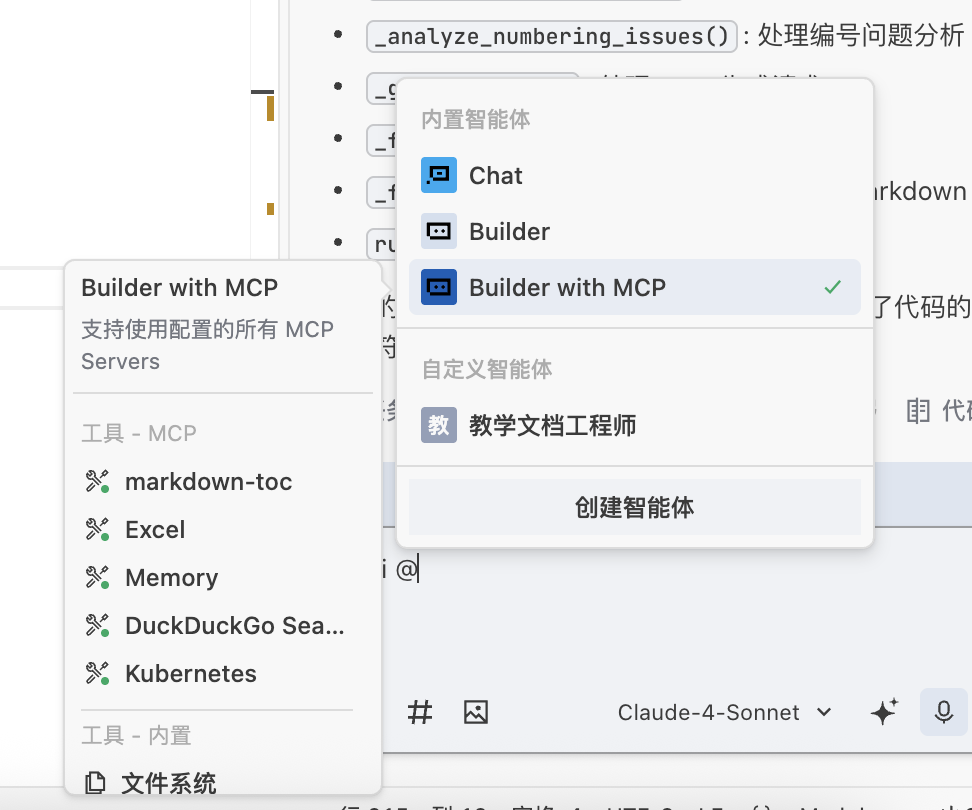
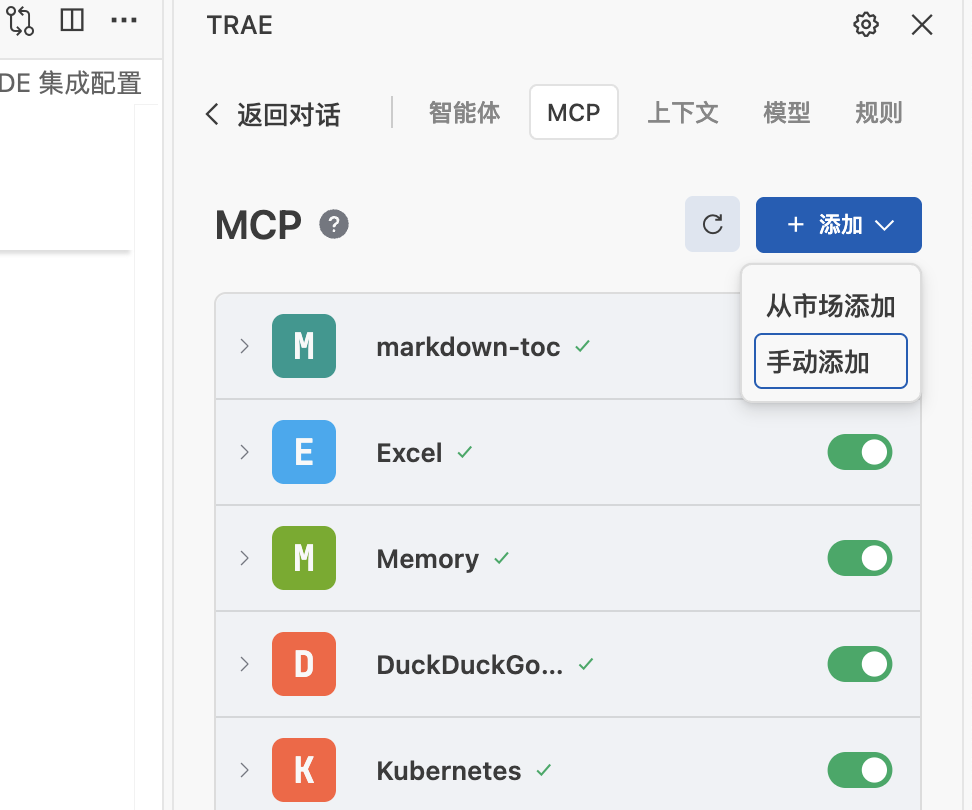
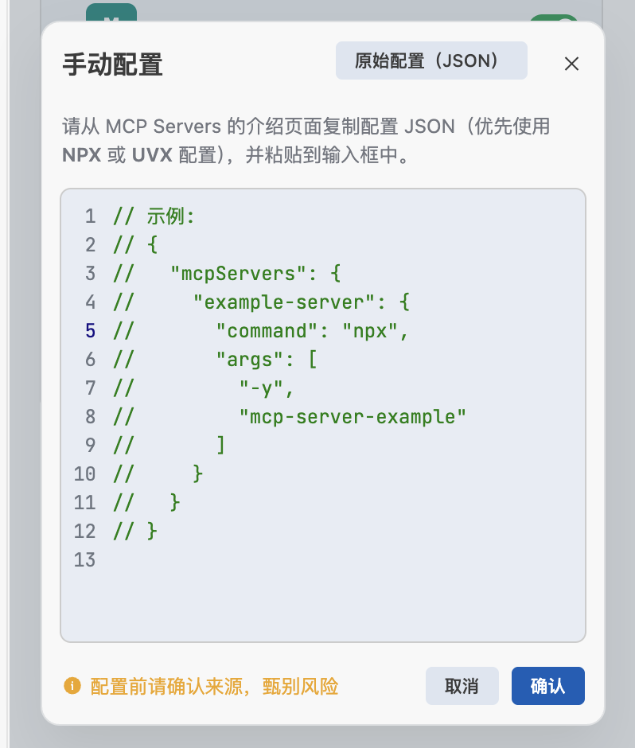
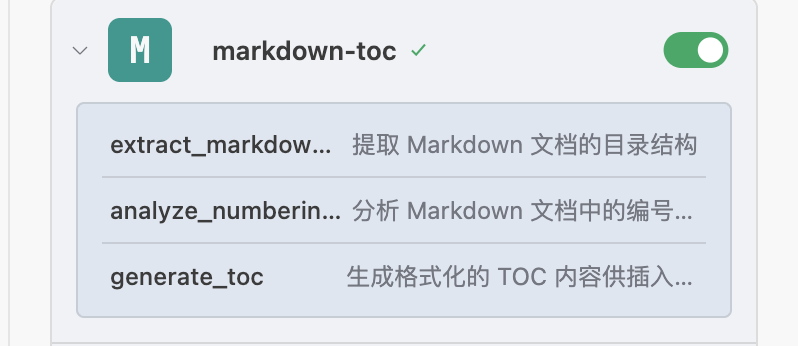
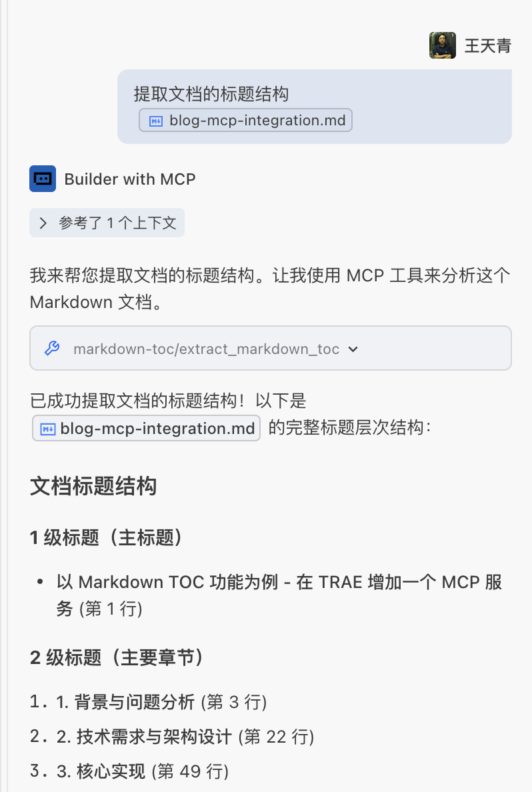

# 从零构建 MCP 服务：为 TRAE IDE 添加智能 Markdown TOC 处理能力

## 1. 背景与问题分析

在技术文档编写过程中，Markdown 格式因其简洁性和可读性被广泛采用。然而，随着文档规模的增长和结构的频繁调整，目录管理成为一个突出的技术问题。这些问题主要体现在**编号一致性问题**：

- **重复编号**：多个章节使用相同编号（如 `1.1 概述` 和 `1.1 介绍`）
- **不连续编号**：章节编号出现跳跃（如 `1.1` 直接跳转到 `1.3`）
- **层级错乱**：标题层级关系不符合逻辑（如 `1.1` 后直接出现 `1.1.1.1`）

当我们让智能体对 Markdown 文档，尤其是复杂 Markdown 文档进行目录修正时，会遇到如下技术挑战：

- **传统工具局限性**：传统 grep 工具（`grep "^#" document.md`）仅支持简单文本搜索，无法有效过滤代码段中的注释标记
- **结构化分析缺失**：提取标题后缺乏结构化分析能力，无法识别编号规律和层级关系
- **复杂度问题**：使用 shell 脚本检测编号冲突和不连续性实现复杂，维护困难
- **输出格式限制**：不支持格式化输出和智能处理，无法满足多样化的文档生成需求

为了解决这些问题，需要引入专业的编程语言解决方案。同时，为了让智能体具备处理复杂目录的功能，需要通过 MCP（Model Context Protocol）协议提供标准化的服务接口。

本文介绍通过 MCP 协议开发专业化文档处理服务的完整技术方案。该方案通过标准化协议接口，为 TRAE IDE 提供智能化的 Markdown 目录管理功能，包括目录提取、编号分析和格式化生成等核心能力。

---

## 2. 技术需求与架构设计

### 2.1 功能需求分析

基于文档处理的实际需求和 MVP 设计原则，本系统需要实现三个核心功能模块：

| **功能模块**     | **核心特性**                             | **技术实现**                  |
| ---------------- | ---------------------------------------- | ----------------------------- |
| **TOC 提取模块** | 支持 1-6 级标题提取（`#` 到 `######`）   | 正则表达式匹配 + 行号精确定位 |
|                  | 精确行号定位和内容记录                   | 逐行扫描算法                  |
|                  | 代码块过滤机制                           | 状态机检测 ``` 边界           |
|                  | 可配置的深度范围控制                     | 参数化深度过滤                |
| **编号分析模块** | 重复编号检测算法                         | 哈希表去重检测                |
|                  | 不连续编号识别                           | 序列连续性验证                |
|                  | 多格式编号支持（阿拉伯数字、中文数字等） | 多正则模式匹配                |
|                  | 层级关系验证                             | 树形结构校验                  |
| **TOC 生成模块** | 多格式输出支持（Markdown、HTML、纯文本） | 模板化渲染引擎                |
|                  | 可配置的显示选项                         | 参数化配置系统                |
|                  | 链接生成和缩进控制                       | 自动锚点生成 + 层级缩进控制   |

### 2.2 技术架构

系统采用分层架构设计，确保职责分离和模块化：

```text
┌─────────────────────────────────────┐
│           TRAE IDE                  │  ← 用户界面层
├─────────────────────────────────────┤
│         MCP Protocol                │  ← 协议通信层
├─────────────────────────────────────┤
│        MCP Server Layer             │  ← 服务接口层
│  ┌────────────────────────────────┐ │
│  │     MCPServer Class            │ │
│  │  - Tool Registration           │ │  ← 工具注册与路由
│  │  - Request Handling            │ │  ← 请求处理与验证
│  │  - Response Formatting         │ │  ← 响应格式化
│  └────────────────────────────────┘ │
├─────────────────────────────────────┤
│      Business Logic Layer           │  ← 业务逻辑层
│  ┌────────────────────────────────┐ │
│  │  MarkdownTOCExtractor Class    │ │
│  │  - extract_toc()               │ │  ← TOC 提取算法
│  │  - analyze_numbering_issues()  │ │  ← 编号分析算法
│  │  - generate_toc()              │ │  ← TOC 生成算法
│  └────────────────────────────────┘ │
└─────────────────────────────────────┘
```

**架构特点：**

- **分层解耦**：各层职责明确，降低模块间耦合度
- **协议标准化**：基于 MCP 协议，确保与 TRAE IDE 的标准化集成
- **异步处理**：支持并发请求处理，提升系统响应性能
- **错误隔离**：各层独立的错误处理机制，提高系统稳定性

---

## 3. 核心实现

### 3.1 MarkdownTOCExtractor 类设计

[核心业务逻辑类](../src/markdown_toc/extractor.py)，负责所有 TOC 相关的处理功能。该类采用无状态设计，确保线程安全和高性能：

````python
class MarkdownTOCExtractor:
    """
    Markdown TOC 提取和分析核心类

    设计原则：
    - 无状态设计，支持并发调用
    - 纯函数式接口，便于测试和维护
    - 模块化功能，职责单一明确
    """

    def __init__(self):
        """初始化提取器，无需配置参数"""
        pass

    def extract_toc(self, content: str, min_depth: int = 1,
                   max_depth: int = 6, include_line_numbers: bool = True) -> List[Dict[str, Any]]:
        """
        从 Markdown 内容中提取 TOC 信息

        核心算法：
        1. 预处理：移除代码块中的伪标题（使用状态机识别 ``` 边界）
        2. 标题识别：使用正则表达式 r'^(#{1,6})\s+(.+)$' 匹配标题行
        3. 深度过滤：根据 min_depth 和 max_depth 参数过滤结果
        4. 结构化输出：返回包含级别、标题、行号等信息的字典列表

        Args:
            content: Markdown 文档内容字符串
            min_depth: 最小标题深度 (1-6)，默认为 1
            max_depth: 最大标题深度 (1-6)，默认为 6
            include_line_numbers: 是否包含行号信息，默认为 True

        Returns:
            标题信息列表，每个元素包含：
            - level: 标题级别 (1-6)
            - title: 标题文本（已清理 Markdown 格式）
            - line_number: 行号 (当 include_line_numbers=True 时)
            - raw_line: 原始行内容

        Raises:
            ValueError: 当 min_depth 或 max_depth 不在 1-6 范围内时
        """
        pass

    def analyze_numbering_issues(self, headers: List[Dict[str, Any]],
                                check_types: List[str] = None) -> Dict[str, Any]:
        """
        分析标题编号问题

        支持的检查类型：
        - 'duplicates': 检查重复编号（使用哈希表算法）
        - 'discontinuous': 检查不连续编号（序列连续性验证）
        - 'formats': 检查编号格式一致性（计划中）
        - 'missing': 检查缺失编号（计划中）

        Args:
            headers: 由 extract_toc 返回的标题信息列表
            check_types: 要执行的检查类型列表，默认为 ['duplicates', 'discontinuous']

        Returns:
            编号问题分析结果：
            - has_issues: 是否存在问题
            - duplicate_numbers: 重复编号列表（当 'duplicates' 在 check_types 中时）
            - discontinuous_numbers: 不连续编号信息（当 'discontinuous' 在 check_types 中时）
            - statistics: 统计信息（总标题数、有编号标题数等）
        """
        pass

    def generate_toc(self, headers: List[Dict[str, Any]], format_type: str = 'markdown',
                     include_links: bool = False, max_level: Optional[int] = 6) -> Dict[str, Any]:
        """
        生成格式化的 TOC 内容

        支持的输出格式：
        - 'markdown': 标准 Markdown 列表格式，支持链接生成
        - 'html': HTML 有序/无序列表格式
        - 'text': 纯文本格式，使用缩进表示层级

        Args:
            headers: 由 extract_toc 返回的标题信息列表
            format_type: 输出格式 ('markdown', 'html', 'text')
            include_links: 是否包含链接（仅对 markdown 格式有效）
            max_level: 最大包含的标题级别

        Returns:
            生成的 TOC 信息：
            - content: 格式化的 TOC 内容
            - format: 使用的格式
            - total_items: 包含的条目数
            - levels_included: 包含的级别范围
        """
        pass

    def _remove_code_blocks(self, content: str) -> str:
        """
        移除代码块中的内容，避免误识别代码注释为标题

        使用状态机算法识别 ``` 和 ~~~ 代码块边界
        """
        pass

    def _extract_headers(self, content: str) -> List[Dict[str, Any]]:
        """
        提取标题信息的核心算法

        使用正则表达式逐行扫描，提取标题级别和内容
        """
        pass

    def _chinese_number_to_int(self, chinese_num: str) -> Optional[int]:
        """
        将汉字数字转换为阿拉伯数字

        支持：一、二、三...十、十一...九十九等格式

        Args:
            chinese_num: 汉字数字字符串

        Returns:
            对应的阿拉伯数字，如果无法转换则返回 None
        """
        pass

    def _extract_number_from_title(self, title: str, level: int) -> Optional[str]:
        """
        从标题中提取编号，支持多种编号格式

        支持的编号格式：
        - 阿拉伯数字：1.1、1.1.1、1)、(1) 等
        - 中文数字：一、二、三、第一章、第二节 等
        - 罗马数字：I、II、III、i、ii、iii 等

        Args:
            title: 标题文本
            level: 标题级别

        Returns:
            提取到的完整编号字符串，如果没有找到则返回 None
        """
        pass

    def _clean_title_text(self, title: str) -> str:
        """清理标题文本中的 Markdown 格式（粗体、斜体、链接等）"""
        pass

    def _generate_markdown_toc(self, headers: List[Dict[str, Any]], include_links: bool) -> str:
        """生成 Markdown 格式的 TOC，支持自动锚点链接生成"""
        pass

    def _generate_html_toc(self, headers: List[Dict[str, Any]]) -> str:
        """生成 HTML 格式的 TOC，使用嵌套列表结构"""
        pass

    def _generate_text_toc(self, headers: List[Dict[str, Any]]) -> str:
        """生成纯文本格式的 TOC，使用空格缩进表示层级"""
        pass

    def _generate_anchor(self, title: str) -> str:
        """
        为标题生成 GitHub 风格的锚点链接

        规则：小写化、空格转连字符、移除特殊字符
        """
        pass
````

### 3.2 MCP 服务器实现

#### 3.2.1 MCP 协议框架

Model Context Protocol (MCP) 是 Anthropic 开发的开放标准协议，用于连接 AI 助手与外部工具和数据源。MCP 采用客户端-服务器架构，通过标准化的 JSON-RPC 协议进行通信。

**核心特性：**

- **标准化接口**：统一的工具注册和调用机制
- **类型安全**：基于 JSON Schema 的参数验证
- **异步支持**：原生支持异步操作和并发处理
- **多传输层**：支持 stdio、HTTP、WebSocket 等传输方式

**技术栈选择：**

```python
# 核心 MCP 框架
mcp>=1.0.0              # Anthropic 官方 MCP Python SDK

# 异步运行时
asyncio>=3.4.3          # Python 原生异步框架

# 配置和日志
pyyaml>=6.0             # YAML 配置文件解析
logging.handlers        # 轮转日志支持
```

#### 3.2.2 服务器架构实现

[MCP 服务器](../src/server/mcp_server.py)采用事件驱动的异步架构，通过装饰器模式注册工具处理器：

```python
class MCPServer:
    """
    Markdown TOC MCP 服务器主类

    架构特点：
    - 基于 MCP 标准协议，确保与各种 AI 客户端兼容
    - 异步处理架构，支持高并发请求
    - 统一错误处理机制，提供详细的错误信息
    - 结构化日志记录，便于问题诊断和性能监控
    """

    def __init__(self):
        """
        初始化 MCP 服务器，配置日志和处理器

        初始化过程：
        1. 创建 MarkdownTOCExtractor 实例
        2. 配置日志系统（支持文件和控制台输出）
        3. 注册工具处理器（extract_toc、analyze_numbering、generate_toc）
        4. 设置异常处理机制
        """
        pass

    def setup_handlers(self):
        """
        设置请求处理器，通过装饰器注册工具

        注册三个核心处理器：
        - handle_list_tools(): 工具发现接口，向客户端声明可用工具
        - handle_call_tool(): 工具调用分发器，根据工具名称路由到具体处理方法
        - handle_error(): 统一错误处理器，格式化错误响应

        工具注册过程：
        1. 定义工具元数据（名称、描述、参数 Schema）
        2. 绑定处理函数到工具名称
        3. 设置参数验证规则
        4. 配置权限和限流策略
        """
        pass

    async def _extract_markdown_toc(self, arguments: Dict[str, Any]) -> CallToolResult:
        """
        处理 TOC 提取请求

        参数验证：
        - file_path: 必需，Markdown 文件的绝对路径
        - min_depth: 可选，最小标题深度 (1-6)，默认 1
        - max_depth: 可选，最大标题深度 (1-6)，默认 6
        - include_line_numbers: 可选，是否包含行号，默认 True

        处理流程：
        1. 参数验证和类型检查
        2. 文件存在性和可读性验证
        3. 文件内容读取（支持 UTF-8 编码）
        4. 调用 extractor.extract_toc() 进行处理
        5. 结果格式化和返回

        错误处理：
        - FileNotFoundError: 文件不存在
        - PermissionError: 文件权限不足
        - UnicodeDecodeError: 文件编码问题
        - ValueError: 参数值无效

        Args:
            arguments: 包含 file_path, min_depth, max_depth, include_line_numbers 等参数

        Returns:
            包含提取结果的 CallToolResult，格式化为 JSON 文本内容，包含：
            - headers: 标题信息列表
            - total_count: 总标题数
            - levels_found: 发现的标题级别
            - file_info: 文件元信息
        """
        pass

    async def _analyze_numbering_issues(self, arguments: Dict[str, Any]) -> CallToolResult:
        """
        处理编号问题分析请求

        参数验证：
        - file_path: 必需，Markdown 文件的绝对路径
        - check_types: 可选，检查类型列表，默认 ['duplicates', 'discontinuous']

        处理流程：
        1. 首先调用 extract_toc 获取标题信息
        2. 调用 extractor.analyze_numbering_issues() 进行分析
        3. 生成详细的分析报告
        4. 提供修复建议（如果发现问题）

        分析维度：
        - 重复编号检测：使用哈希表快速识别重复项
        - 连续性检查：验证同级标题编号的连续性
        - 格式一致性：检查编号格式的统一性（计划中）
        - 缺失编号：识别跳跃的编号序列（计划中）

        Args:
            arguments: 包含 file_path, check_types 等参数

        Returns:
            包含分析结果的 CallToolResult，包括：
            - has_issues: 是否发现问题
            - issues_summary: 问题摘要
            - detailed_analysis: 详细分析结果
            - suggestions: 修复建议
            - statistics: 统计信息
        """
        pass

    async def _generate_toc(self, arguments: Dict[str, Any]) -> CallToolResult:
        """
        处理 TOC 生成请求

        参数验证：
        - file_path: 必需，Markdown 文件的绝对路径
        - format_type: 可选，输出格式 ('markdown', 'html', 'text')，默认 'markdown'
        - include_links: 可选，是否包含链接，默认 True（仅对 markdown 格式有效）
        - max_level: 可选，最大包含级别，默认 6

        生成特性：
        - Markdown 格式：支持 GitHub 风格的锚点链接
        - HTML 格式：生成语义化的嵌套列表结构
        - 文本格式：使用缩进表示层级关系

        链接生成规则（Markdown 格式）：
        1. 标题文本小写化
        2. 空格替换为连字符
        3. 移除特殊字符（保留字母、数字、连字符）
        4. 生成 #anchor-name 格式的链接

        Args:
            arguments: 包含 file_path, format_type, include_links, max_level 等参数

        Returns:
            包含生成的 TOC 内容的 CallToolResult，包含：
            - content: 格式化的 TOC 内容
            - format: 使用的格式
            - total_items: 包含的条目数
            - levels_included: 包含的级别范围
            - generation_time: 生成耗时
        """
        pass

    def _format_toc_as_text(self, headers: List[Dict], file_path: str) -> str:
        """
        将标题列表格式化为纯文本 TOC

        格式特点：
        - 使用空格缩进表示层级（每级 2 个空格）
        - 显示标题级别和行号信息
        - 支持自定义前缀符号

        Args:
            headers: 标题信息列表
            file_path: 文件路径（用于生成标题）

        Returns:
            格式化的纯文本 TOC 字符串
        """
        pass

    def _format_toc_as_markdown(self, headers: List[Dict], file_path: str) -> str:
        """
        将标题列表格式化为 Markdown TOC

        格式特点：
        - 使用 Markdown 列表语法
        - 自动生成锚点链接
        - 支持多级嵌套
        - 兼容 GitHub 风格

        Args:
            headers: 标题信息列表
            file_path: 文件路径（用于生成标题）

        Returns:
            格式化的 Markdown TOC 字符串
        """
        pass

    async def run(self):
        """
        启动 MCP 服务器

        启动流程：
        1. 初始化服务器配置
        2. 注册工具处理器
        3. 启动异步事件循环
        4. 监听客户端连接
        5. 处理工具调用请求

        服务器特性：
        - 使用 stdio 传输层与客户端通信
        - 支持异步处理多个请求
        - 自动错误恢复机制
        - 优雅关闭处理
        - 性能监控和统计
        """
        pass
```

---

## 4. 配置与部署

详细参考：[配置说明](../docs/setup.md)。›

### 4.1 TRAE IDE 集成配置

在 TRAE IDE 中配置 MCP 服务器需要以下步骤：

**步骤 1：选择智能体**：



选择智能体类型：`Builder with MCP`。

**步骤 2：添加 MCP 服务器配置**：

1. 打开右上角"AI 功能管理"，选择 `MCP Server`，如下图所示：
   - 
2. 点击 “添加”，选择“手工添加”，如下图所示：
   - 
3. 将[MCP 配置文件](../config/trae_mcp_config.json)内容复制到输入框中，如下图所示：
   - 

**步骤 3：启动 MCP 服务**:

现在我们可以启用 `markdown-toc` 服务，如下图所示：


将右侧按钮滑动到开启状态，即可启动 MCP 服务。点击左侧 `>` 图标，即可查看功能：


### 4.2 功能使用

**TOC 提取调用示例**：

```text
请使用 MCP 工具提取文档的标题结构。
```

或者直接说：

```text
提取文档的标题结构。
```

示例输出：



**编号分析调用示例**：

```text
请检查文档中的标题编号是否存在重复或不连续问题。
```

**TOC 生成调用示例**：

```text
请生成 Markdown 格式的目录，包含链接，最大显示到 4 级标题。
```

## 5. 总结

项目地址：[markdown-mcp](https://github.com/ForceInjection/markdown-mcp)。

通过本项目的实践，我们深度验证了 MCP 协议在专业工具开发中的技术可行性和实际应用价值。本项目不仅是一个 MVP 功能的 Markdown 文档处理工具，更是一个 MCP 协议实践的完整示例，为开发者提供了从架构设计到部署运维的全流程参考。

```text
智能体 = 上下文工程 + 大模型 + 工具
```

当现有的 AI 工具无法满足特定需求时，开发自定义的 MCP Server 成为了最佳解决方案。AI 智能体的核心能力建立在上下文工程和大语言模型的基础之上，而 MCP 工具的价值在于为智能体提供结构化、高质量的上下文信息。通过标准化的协议接口，我们的工具能够让 AI 智能体更精准地理解文档结构，更高效地处理文档任务，从而显著提升整体的文档处理效率和质量。
